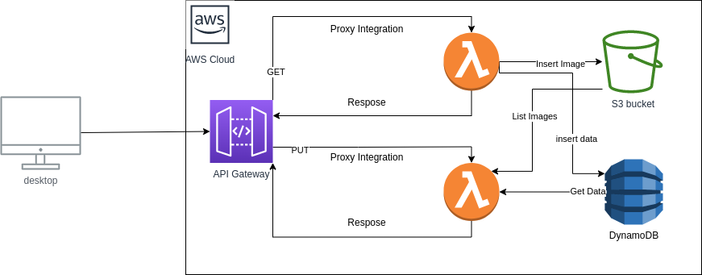

# Friendsurance-coding

This repository contains CloudFormation Template.



## Commands from Tutorials

### Upload Python code

Create s3 bucket then upload python code
by default s3 bucket is named 'upload-image-code'
then upload the "package.zip"

### Create Cloudformation Stack

Create Cloudformation Stack by running this cmd
```bash
aws cloudformation create-stack --template-body file://templates/images.yaml --stack-name images --capabilities CAPABILITY_IAM
```
